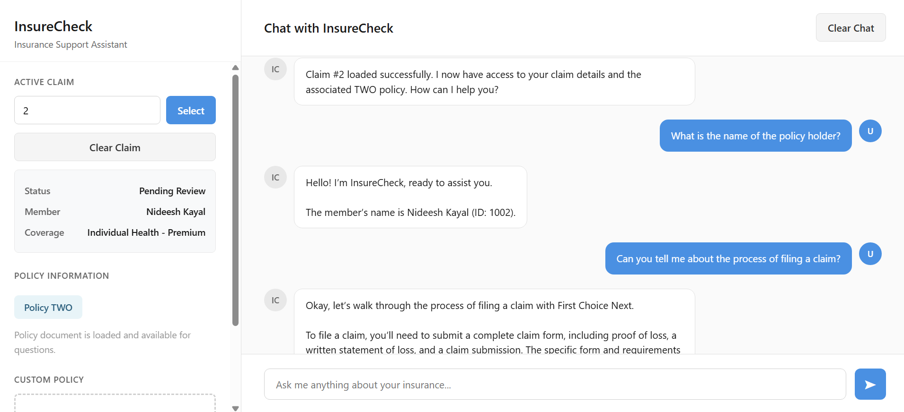
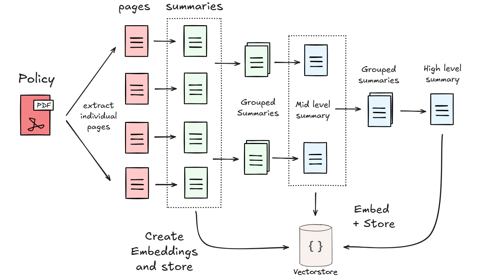
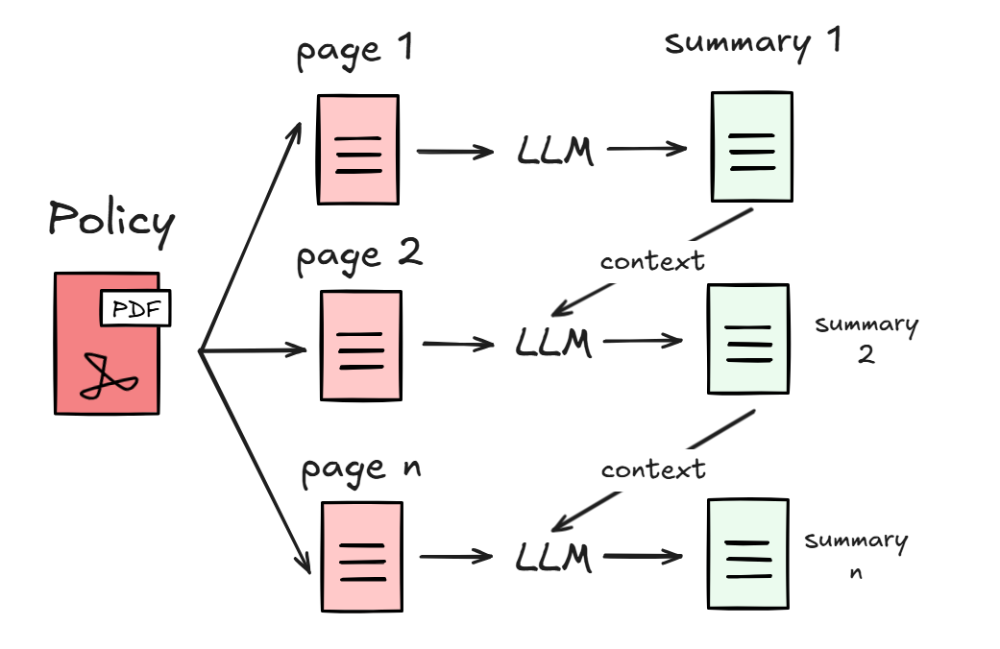

# InsureCheck

InsureCheck is a flask based chatbot web application designed to automate insurance related customer support using RAG (Retrieval Augmented Generation)

It helps users access claim status updates, understand their policy
terms, and get instant answers to common insurance questions. 



Cuurently, InsureCheck uses sample claims data with attached policiy ids and sample policy pdfs for each of those policy ids

The system uses a Retrieval Augmented Generation (RAG) architecture that retrieves contextually relevant data (such as claim records, policy details, etc) and passes it to a Large Language Model (LLM) for generating accurate and grounded responses.

## How It Works

The user enters the claim ID. All the relevant claim detais are stored in the context. Based on the user query, all the relevant documents from the associated policy is retrieved using a similarity search on the embeddings of the summaries of the policy that has been created and stored in a vector store

Tech Used: Flask, Ollama, HuggingFace, ChromaDB, LangChain, HTML, CSS, JS

## Policies Dataset

Check ```policies.ipynb``` in the policies folder for detailed explanations and implementation

There are five separate sample policies that we have used for InsureCheck

All the policy dataset related files are available in the policies folder

The original policy pdfs are stored in the documents folder inside the policies folder

A RAPTOR like index was created for these policies, so that it can handle specific questions as well as high level questions during the retrieval process

> Original reference for RAPTOR: https://arxiv.org/html/2401.18059v1

### How this works

First, we take the policy pdfs and convert it to txt files for each individual pages in the pdf.

Then we use an LLM to summarize the content for each page and store those summaries as embeddings in our vector store. These are helpful for specific questions related to a page and will be retrieved in those cases.

For more general questions, we create summaries of summaries, i.e. mid level and high level summaries and store these as embeddings as well.



### Creating Summaries

We create summaries for each policy page

#### Why summarize?

- Makes the extracted data cleaner and more concise
- The embeddings model all-MiniLM-L6-v2 that we used has a token limit of 256 word pieces after which the data is truncated. Thus creating summaries helps avoid data loss

> https://huggingface.co/sentence-transformers/all-MiniLM-L6-v2

#### How it works

We use a method similar to interleaving where each summary page receives the context of the previous page's summary, which helps the LLM understand references to the earlier content and creating coherent summaries.



> Original Interleaving Idea Reference: https://arxiv.org/pdf/2212.10509

We also create mid and high level summaries as well

All of these summaries were then converted into embeddings and stored in a vector database ```chroma_store```

A function was written in the ```policy.py``` to later query these documents by performing a semantic search based on the question and the metadata filters


## Getting Started

1. Clone the repository

```
git clone https://github.com/nideeshkayal/InsureCheck.git
cd insurecheck
```

2. Virtual Environment and Installing dependencies

Create a virtual environment and then

```
pip install -r requirements.txt
```

3. LLM Setup

Ensure you have ollama installed for running the model locally

```
ollama pull gemma3:1b
```

You can chenge the model in app.py and policies/policies.ipynb if needed

4. Run the application

```
python app.py
```

Open the browser to `http://localhost:5000` or the link given in the terminal

Application Related Notes: Enter a claim ID (1-5) to load sample claim information - the associated policy will be loaded automatically